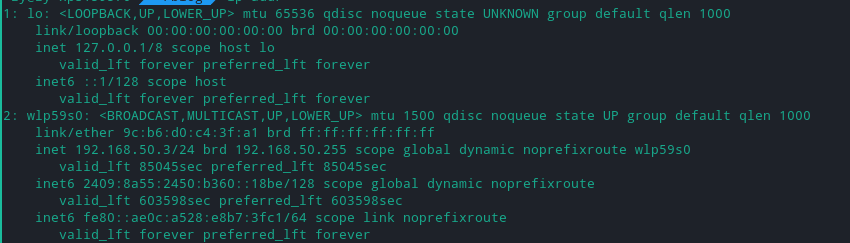
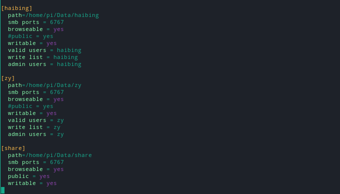
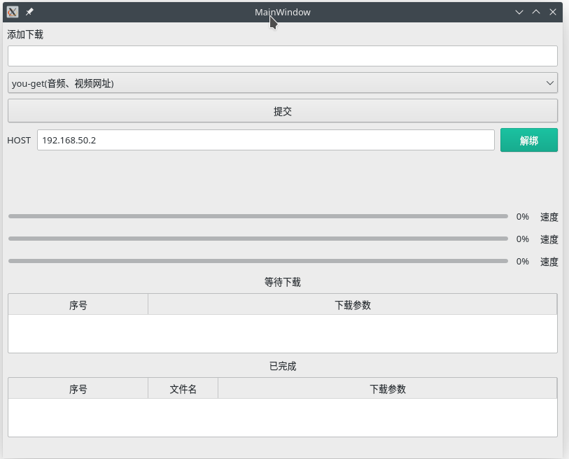

## ToDo









## 获取ipv6且DDNS到腾讯云解析

### 获取ipv6



由上图可以发现ipv6出现的位置很有规律，所以就不要考虑那让人秃头的正则表达式去取ipv6啦！直接找到ipv6存在的那一行然后切片把ipv6带/128或者/64搞出来。在以'/'为特征切片得到ipv6地址

如果你有多个网卡的话那就判断一下那几行是属于哪个网卡就好啦！（投机取巧第一名）

### DDNS（腾讯云）

安装github找到的qcloud-python-sdk，用如下命令安装

```bash
pip install qcloudapi-sdk-python

```

### 持续的DDNS

通过配置systemd实现

包括service和timer文件

Service部分

```systemd
[Unit]
Description=ipv6 DDNS service
[service]
Type=simple
ExecStart=/usr/bin/python3 /home/xxx/Rpi3B+&Samba&&/ddns.py
[Install]
WantedBy=multi-user.target

```

Timer部分

```bash
[Timer]
OnActiveSec=120
[Install]
WantedBy=multi.user.target
```

记得把他们加入/etc/systemd/system里面或者/usr/lib/systemd/system中

不要忘记reload和enable以及start

## samba配置

### 添加用户

Samba需要使用已有的用户账号，所以我们先使用useradd添加账号，然后再通过 smbpasswd -a 添加到Samba

### 目录配置

如图


我在2T的硬盘中手动的为用户分配了文件夹

## 下载部分配置

### Aria2负责给出下载链接的任务

### you-get负责主流网站的媒体下载任务

**奇怪的地方**：B站番剧下载很正常，其他资源似乎会卡在链接的部分

这个很好实现

<del>（用别人的东西还不会用吗）</del>

现在的关键是如何把下载信息弄到网页里。

有两个思路

1. 修改源代码，把下载进度条部分信息转移出来
2. 从终端里把下载进度取出来，转移到网页中

#### 思路1

我为什么要自找麻烦啊啊啊啊！！！！ 看了一遍源代码发现要从几个不同的位置获取不同信息，而且我这个大新手对于大项目很不熟悉，在写了会儿注释后，开始思索思路2。

#### 思路2

通过一个py脚本执行you-get然后从终端里面不停的读，然后跟新网页信息，到时候只需要在判断（出现异常或者下载结束）的时候关闭管道，再发送信息给网页（下载异常或者完成）
（未完成）

#### 思路1+思路2 √

在you-get脚本结束的位置加一个标记供思路二识别（print函数记得设置end标记，不然一个\n够DEBUG一会了 - -）

### 改Aria2的web界面或者写一个下载界面

#### QTUI

使用qt写了一个简单的页面


包括下载器的选择，等待下载，完成列表的显示，以及选择远程服务器（取消下载有些难度）
### 通过不同的下载方式和文件类型配置存放目录

## Flask框架

用于提供WebApi 加入验证
